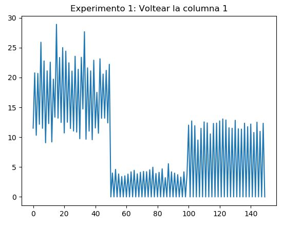
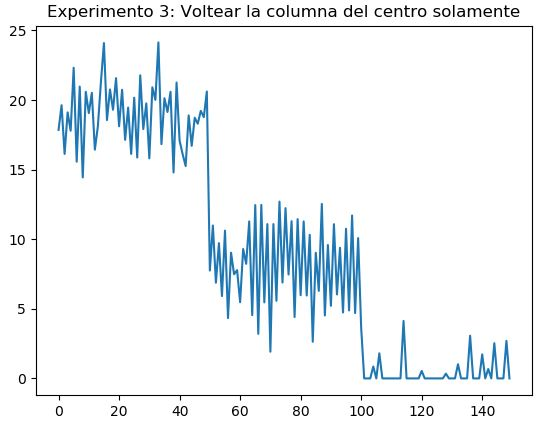
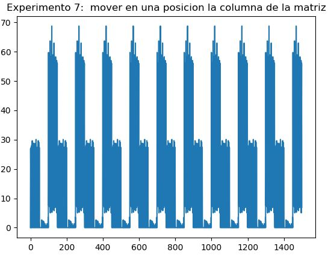
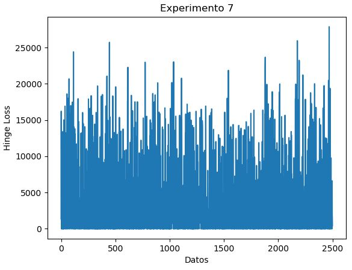

# Linear Classifier + Genetic Mutation Experiments

A from-scratch **multiclass linear classifier** written in Python and NumPy. It is scored with a hand-written **multiclass SVM (hinge) loss** and "trained" with **genetic-algorithm-style mutations** of its weight matrix instead of gradient descent. It is tested on two classic datasets: **Iris** and **CIFAR-10**.

> Built in 2018 for the *Inteligencia Artificial* course at the **Instituto Tecnológico de Costa Rica** (Computer Engineering). The full write-up, in Spanish, is in [`Modelo_Lineal_y_Algoritmos_Geneticos.pdf`](Modelo_Lineal_y_Algoritmos_Geneticos.pdf).

## Highlights

- **No ML framework for the model.** The scores `s = W·x`, the bias trick, and the hinge loss are all implemented by hand with NumPy.
- **Two datasets behind one interface:** the 150-sample Iris set (via scikit-learn) and raw CIFAR-10 pickle batches, flattened to pixel vectors.
- **An experimental method.** Eight different mutation operators are compared on both datasets, and every run is recorded as a loss curve.
- **Early stopping:** training halts when successive loss values stop changing by more than a precision hyperparameter.
- **An honest write-up**, including negative results. See [Retrospective](#retrospective) for why the loss never converged.

## How it works

```
 data ──► x = [features..., 1]  (bias trick)
                │
 W (classes × features+1)  ~ Uniform(0, 8)
                │
        scores = W @ x
                │
   hinge loss  L = Σ_{j≠y} max(0, s_j − s_y + 1)
                │
        record loss ──► mutate W ──► next sample
                │
   stop when the loss curve stabilises (precision = 15)
```

1. **Weight initialisation:** `W` is sampled from `np.random.uniform(0, 8)`, a range chosen to match the scale of the Iris features.
2. **Input:** each sample is taken one at a time (`steps = 1`), and a constant `1` is appended so the bias `b` lives inside `W`.
3. **Scoring and loss:** the model computes class scores `W @ x` and evaluates the multiclass hinge loss against the true label.
4. **Mutation:** `W` is changed by one of the operators below, and the loop moves on to the next sample. It wraps around the dataset for up to 2,500 iterations.
5. **Stopping rule:** `fin_Mutacion` stops the loop when successive loss values stay within `precision` of each other.

## Experiments

| # | Mutation operator applied to `W` |
|---|---|
| 1 | Flip (reverse) a single column |
| 2 | Flip the first and last columns |
| 3 | Flip only the centre column |
| 4 | Split into two halves and swap values inward within each half, first column only |
| 5 | Same as 4, on the first and last columns |
| 6 | Same as 4, on the second and last columns |
| 7 | `np.roll` one column down by one position |
| 8 | Roll every column *i* down by *i* positions |

Each experiment was run on Iris (3 classes, 150 samples, repeated up to 1,500 times) and on the first classes of CIFAR-10 (the 1,024-value red channel of each 32×32 image).

## Results

| Iris, Exp. 1: flip a column | Iris, Exp. 3: flip centre column |
|---|---|
|  |  |

| Iris, Exp. 7: roll a column | CIFAR-10, Exp. 7 |
|---|---|
|  |  |

The loss was not reduced by any operator on either dataset. The curves oscillate or repeat periodically, which the original report noted without being able to explain.

## Retrospective

Looking at this project again years later, the causes are clear, and they make a good lesson in optimisation:

- **There was no selection step.** A genetic algorithm needs *fitness-based selection*, which means keeping the mutated `W` only if it lowers the loss. Here every mutation was accepted unconditionally, so the search was a blind walk.
- **The mutations only permuted values.** Flips, swaps and rolls rearrange the numbers already in `W` and never create new ones. Every one of these operators is also *periodic*. Applied repeatedly, it brings `W` back to its starting state after a few steps: 2 steps for a flip, and at most the number of classes for a roll. That is exactly the repeating pattern in Experiments 7 and 8.
- **The loss was measured on a different sample every step.** This means the curve mixes "the model changed" with "the input changed". The block-shaped plots for Iris line up with its three class-sorted blocks of 50 samples.
- **Smaller issues:**
  - The CIFAR label shift `label − 1` turns class 0 into `-1`, which Python silently indexes as the last class.
  - The stopping rule checks the *first* 10 loss values rather than the *last* 10.
  - The per-sample loss takes the `max` over classes rather than the sum.

A modern version would add real selection (for example a (1+1) evolution strategy with Gaussian mutation), a population with crossover, or plain gradient descent on the same hinge loss. It would also evaluate on a fixed validation batch.

## Running it

```bash
pip install -r requirements.txt
```

The script loads **CIFAR-10** by default. Download the [CIFAR-10 python version](https://www.cs.toronto.edu/~kriz/cifar.html) and put `data_batch_1` … `data_batch_5` in the directory you run the script from. Then run:

```bash
python Geneticos.py
```

To use **Iris** instead, uncomment the *Iris Data* block near the top of `Geneticos.py` and comment out the `getData()` call. To try another experiment, swap the active body of `mutarW`; the earlier operators are kept there as commented blocks.

## Tech stack

Python 3 · NumPy · scikit-learn (Iris loader) · Matplotlib · Pillow

## Repository layout

```
Geneticos.py                               # model, hinge loss, mutation operators, experiment loop
Modelo_Lineal_y_Algoritmos_Geneticos.pdf   # full report (Spanish)
docs/images/                               # loss curves extracted from the report
```
